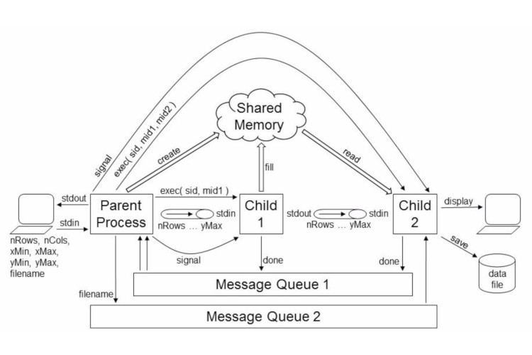
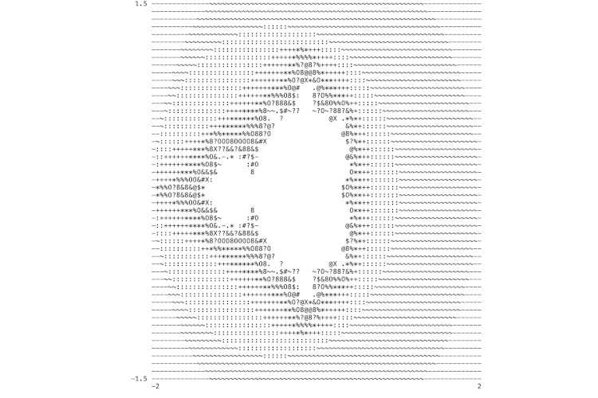
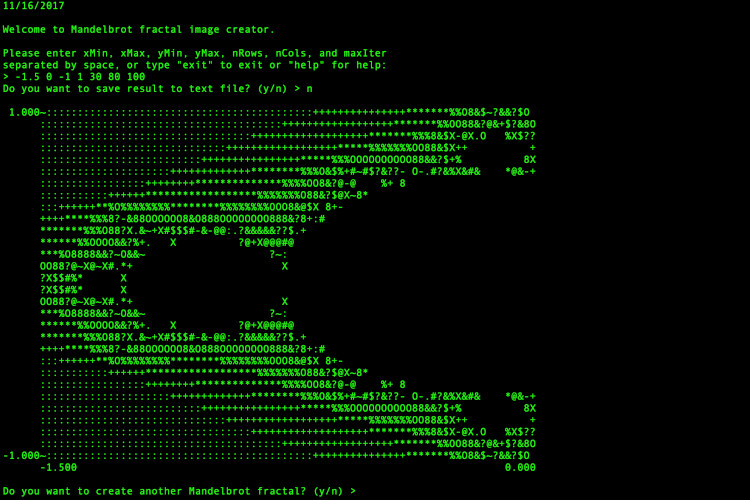

# console-mandelbrot-fractal
Console Mandelbrot Fractal Images

This projects is collection of three programs that work together using inter-process communications to create, display, and store Mandelbrot fractal images. More specifically, the processes use fork / exec, pipes, message queues, shared memory, signals, and process exit codes to coordinate their efforts and communicate information. As shown in the structure diagram below:

- The parent process is responsible for interacting with the human, and for creating and later terminating the inter-process communications structures and child processes.
- The first child performs the Mandelbrot calculations and stores the results in shared memory.
- The second child displays the results to the screen and saves the data to a file for further
processing, e.g. for graphical display in Matlab or some other program.

Files:
mandelbrot.cpp    - Main program.
mandelCalc.cpp    - Child that calculates fractals.
mandelDisplay.cpp - Child that print and saves fractals to .txt files.

Program compilation:
Use command "make" to compile program. This will compile three files:
	Mandelbrot, mandelCalc and mandelDisplay

*Note: this program was written using c+11 standards so for manual compilation
       use --std=c++11 parameter.

Program usage:
To run program type "./Mandelbrot"

Program error codes:  
"-1"  - pipe().  
"-2"  - msgget().  
"-3"  - shmget().  
"-4"  - close().  
"-5"  - dup2().  
"-6"  - execvp().  
"-7"  - fork().  
"-8"  - kill().  
"-9"  - msgsnd().  
"-10" - msgrcv().  
"-11" - shmat().  
"-14" - Ctrl-C handler.  
"-15" - One of the child exited with error.  

    